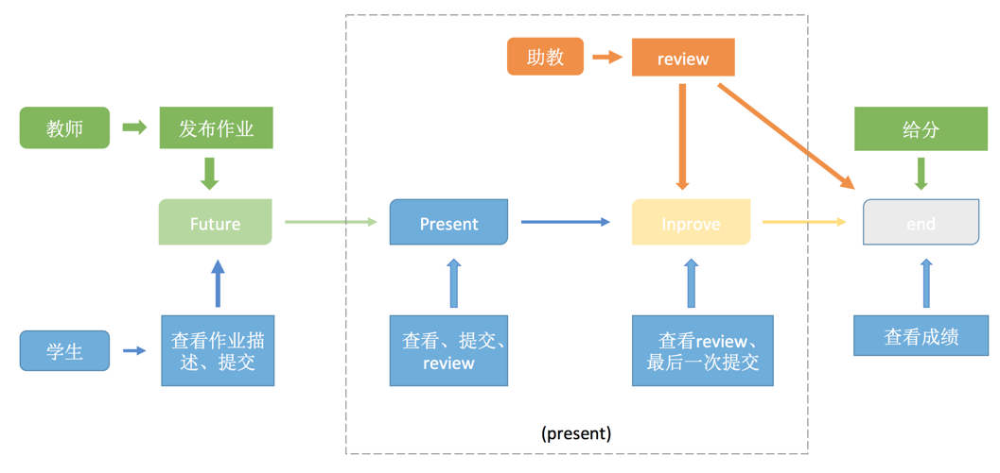
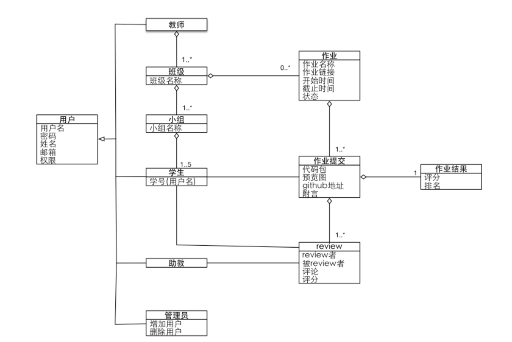

# SYSU Web2.0 Programming Course Project

## 安装项目
> npm install

## 启动项目
- *nix
> DEBUG=hs:* npm start
- Windows
> set DEBUG=hs:* & npm start

## 构建项目
> gulp

## 生成测试数据
> node helper.js

## 项目介绍

学生可以通过此系统：

1. 提交作业
2. 评审作业
3. 查看自己以往的作业、分数和排名

老师和TA可以通过此系统：

1. 布置作业
2. 评审作业

作业流程

系统概念

## 项目亮点

- 自动化构建工具：Gulp
- 模块化：browerify, ES6 module
- 前端框架：AngularJS
- CSS框架：Bootstrap
- JS类库：jQuery, lodash, moment
